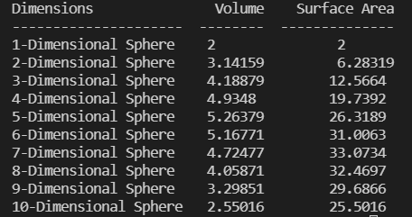

# N-Dimensional_Sphere

This repository stores a Python script I wrote to explore the curse of dimensionality for a Calculus III assignment. 
The assignment asked us to consider why a sphere's volume decreases beyond 5-dimensions in multi-dimensional space. We were also asked to calculate the surface area of the sphere in n-dimensions. I used python to automate these calculations with two recursive algorithms. The output below shows the volume and surface area calculations for a unit sphere to 10-dimensions.

 

 
 
TODO: Add discussion of volume and SA reduction.

